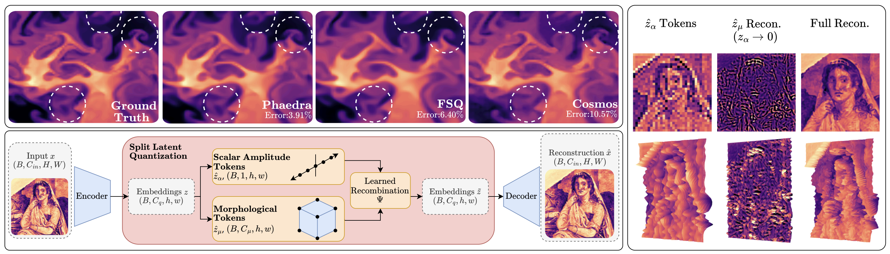

# Phaedra: Learning High-Fidelity Discrete Tokenization for the Physical Sciences

[](https://arxiv.org/abs/2602.03915)
[](https://arxiv.org/abs/2602.03915)
[](https://camlab-ethz.github.io/Phaedra/)
[](https://huggingface.co/llingsch/phaedra)
[](https://huggingface.co/datasets/llingsch/phaedra-tokens)
[](LICENSE)

Levi Lingsch, Georgios Kissas, Johannes Jakubik, Siddhartha Mishra. *NeurIPS 2026.*
[Paper](https://arxiv.org/abs/2602.03915) · [Project page](https://camlab-ethz.github.io/Phaedra/) ·
[Models](https://huggingface.co/llingsch/phaedra) · [Token datasets](https://huggingface.co/datasets/llingsch/phaedra-tokens)

Phaedra is a tokenizer for scientific fields, inspired by shape-gain quantization and proper orthogonal
decomposition. Every 4×4 patch of a field becomes **two discrete tokens**:

- a **morphology token**, the spatial structure, quantized with Finite Scalar Quantization (FSQ, 8640 codes);
- an **amplitude token**, the magnitude, quantized by a dense one-dimensional channel that approximates a
  continuous one (1024 levels).

Keeping the magnitude in its own channel preserves the large dynamic range of physical data, which standard
image tokenizers lose.

<p align="center">
  
</p>

This repository contains the complete code of the paper:

* the **Phaedra tokenizer** — as the lightweight, pip-installable package [`phaedra/`](phaedra) and in the
  full training / evaluation pipeline — and the tokenizer baselines (FSQ, VQ-VAE-2, continuous autoencoder),
* **operator learning in token space**: transformers on Phaedra, FSQ and VQ-VAE-2 tokens and on continuous
  latents, and FNO, CNO and ViT on the physical fields,
* **masked autoencoding** on token grids,
* the **evaluation harness** that produces every number of the operator-learning comparison
  (deterministic, per trajectory).

All trained weights and the tokenized datasets are on the Hugging Face Hub; everything can also be re-trained
from the public [Poseidon](https://huggingface.co/camlab-ethz) datasets.

```
phaedra/            standalone Phaedra tokenizer package: PhaedraModel, load_pretrained()
tokenizer/          Phaedra_AE_FSQ_4x4, AE_FSQ, AE_VQVAE2, AE_Continuous + load_tokenizer API     python -m tokenizer.train
tokens/             tokenizers -> token / latent datasets                                           python -m tokens.generate_tokens, ...
hub/                token-space seq2seq transformer (Phaedra, FSQ tokens)                           python -m hub.trainers.{train,test}
baselines/          continuous-latent transformer, VQ-VAE-2 token transformer                       python -m baselines.train_continuous,
                                                                                                    python -m baselines.arch.long_trainer
fno_operator/ cno_operator/ vit_operator/   physical-space baselines                                python -m fno_operator.train, ...
mae/                masked autoencoding on token grids                                              python -m mae.{train,test}
evaluation/         one harness for all 21 operators: direct / 2-step / 6-6-2, tables, figures      python -m evaluation.eval_downstream
configs/operators/  the 21 operator configurations, named by model id (phaedra_38m_kh.yaml, ...)
scripts/            data preparation, downloads, smoke test, SLURM templates, project-page assets
docs/               project page (GitHub Pages) and the result tables (docs/results)
```

## Installation

```bash
git clone https://github.com/camlab-ethz/Phaedra.git && cd Phaedra
python -m venv .venv && source .venv/bin/activate
pip install -e .                          # the `phaedra` package + all dependencies (torch >= 2.4, CUDA build)
cp env.example.sh env.sh                  # edit the two roots, then
source env.sh                             # PHAEDRA_DATA_ROOT, PHAEDRA_OUTPUT_ROOT, PYTHONPATH
```

The reproduction code (`tokenizer/`, `tokens/`, `hub/`, …) runs from the checkout: `env.sh` puts the repository on
`PYTHONPATH`. `pip install git+https://github.com/camlab-ethz/Phaedra.git` alone gives the standalone `phaedra` package.

The pipeline reads and writes everything relative to these two variables:

```
$PHAEDRA_DATA_ROOT/                                 $PHAEDRA_OUTPUT_ROOT/
  fields/CEU_2D_KelvinHelmholtzLowRes.nc      (KH)     tokenizers/{phaedra_4x4,fsq,vqvae2,continuous}/
  fields/CEU_2D_RiemannCurvedLowRes.nc        (RC)     operators/<model id>/           e.g. operators/phaedra_38m_kh/
  fields/CEU_2D_RiemannKelvinHelmholtzLowRes.nc (RKH)  mae/<model id>/                 e.g. mae/mae_phaedra_3pde/
  tokens/{phaedra,fsq,vqvae2}/CEU2D_*Tokens.nc         evaluation/{tables,figures,fields}/
  latents/continuous/CEU2D_*Latents.nc
```

A run directory holds either released weights (`model.safetensors`) or your own training output
(`checkpoint_last.pt`); every script accepts both.

## Quick start: the pretrained tokenizer

With the standalone package (weights are downloaded from the Hub on first use):

```python
import torch
from phaedra import load_pretrained

model = load_pretrained()                        # the paper's tokenizer (EMA weights)
x = torch.randn(1, 1, 128, 128)                  # one field, normalized per variable: (x - mean) / std
quant, _, (morph, amp), _ = model.encode(x)      # morph, amp: token ids on the 32x32 grid
x_rec = model.decode(quant)
```

With the reproduction code, which also serves the three baseline tokenizers:

```python
from tokenizer.pretrained import load_tokenizer
tok = load_tokenizer("Phaedra_AE_FSQ_4x4")      # local $PHAEDRA_OUTPUT_ROOT/tokenizers/phaedra_4x4, else the Hub
amp, morph = tok.encode(x)                        # [B, 32, 32] each; amp in [0, 1024), morph in [0, 8640)
x_rec = tok.decode((amp, morph))                  # also "AE_FSQ", "AE_VQVAE2", "AE_Continuous"
```

Both give identical tokens and reconstructions. The normalization statistics of the datasets used in the
paper are in [`evaluation/eval_registry.yaml`](evaluation/eval_registry.yaml).

## Reproduce the paper's results with the released weights

```bash
python scripts/download_pretrained.py tokenizers operators          # ~5 GB  -> $PHAEDRA_OUTPUT_ROOT
python scripts/download_pretrained.py tokens                        # ~44 GB -> $PHAEDRA_DATA_ROOT (or --tokens phaedra ...)
python scripts/prepare_poseidon_data.py --datasets CE-KH CE-CRP CE-RPUI --download   # ground-truth fields, see Data
sbatch scripts/slurm/evaluate.sbatch                                # 21 array tasks, ~15-30 min each on one GPU
python -m evaluation.verify_report                                  # tables (md / tex / csv), figures, REPORT.md
```

`python scripts/download_pretrained.py eval phaedra_38m_kh` fetches just what one model needs. With
`--deterministic` the evaluation is bit-reproducible on a given GPU model; on an RTX 4090 the released weights
reproduce every per-trajectory error of the paper's evaluation exactly. The tables of the paper are in
[`docs/results/`](docs/results).

## Results

Relative $L_1$ error (%) at the final time $t = 0.7$, 240 test trajectories per dataset; each model under its
best prediction strategy (direct $0 \to t$, 2-step autoregressive, 6-6-2 rollout $0\to6\to12\to14$); ± is the
95 % bootstrap CI of the mean. All models have ~38M parameters (VQ-VAE-2: 44.3M, larger vocabularies).

| model | data | ρ | u | v | p | average | strategy |
|---|---|---|---|---|---|---|---|
| FNO | KH | 6.24 | 11.18 | 32.23 | 0.54 | 12.55 ± 0.36 | 6-6-2 |
| FNO | RC | 26.31 | 53.62 | 53.42 | 9.16 | 35.63 ± 0.69 | 6-6-2 |
| FNO | RKH | 10.08 | 26.36 | 25.67 | 4.54 | 16.66 ± 0.91 | 6-6-2 |
| CNO | KH | 5.06 | 9.10 | 25.93 | 0.51 | 10.15 ± 0.32 | 2-step |
| CNO | RC | 22.65 | 44.44 | 44.66 | 7.94 | 29.92 ± 0.74 | 2-step |
| CNO | RKH | 6.79 | 18.83 | 18.50 | 3.17 | 11.82 ± 0.82 | 6-6-2 |
| ViT | KH | 4.64 | 8.25 | 23.33 | 0.51 | 9.18 ± 0.27 | 6-6-2 |
| ViT | RC | 28.76 | 60.17 | 59.51 | 10.28 | 39.68 ± 0.58 | direct |
| ViT | RKH | 9.09 | 20.86 | 19.66 | 3.18 | 13.20 ± 0.79 | 6-6-2 |
| Continuous-latent transformer | KH | 4.64 | 8.34 | 23.53 | 0.61 | 9.28 ± 0.30 | 6-6-2 |
| Continuous-latent transformer | RC | 77.95 | 197.31 | 156.93 | 44.00 | 119.05 ± 2.96 | direct |
| Continuous-latent transformer | RKH | 7.09 | 18.09 | 17.87 | 3.18 | 11.56 ± 0.70 | 6-6-2 |
| VQ-VAE-2 transformer | KH | 7.95 | 13.90 | 38.04 | 0.68 | 15.14 ± 0.48 | 6-6-2 |
| VQ-VAE-2 transformer | RC | 29.54 | 63.17 | 64.39 | 12.48 | 42.40 ± 0.63 | direct |
| VQ-VAE-2 transformer | RKH | 14.73 | 38.09 | 37.29 | 7.97 | 24.52 ± 1.15 | 6-6-2 |
| FSQ transformer | KH | 5.30 | 10.91 | 28.27 | 0.62 | 11.28 ± 0.34 | 6-6-2 |
| FSQ transformer | RC | 28.12 | 57.08 | 56.77 | 10.21 | 38.05 ± 1.05 | 6-6-2 |
| FSQ transformer | RKH | 10.37 | 27.73 | 28.78 | 5.08 | 17.99 ± 1.37 | 6-6-2 |
| **Phaedra transformer** | KH | 4.78 | 8.43 | 24.29 | 0.51 | 9.50 ± 0.34 | direct |
| **Phaedra transformer** | RC | 20.66 | 40.73 | 40.42 | 7.02 | 27.21 ± 0.71 | 6-6-2 |
| **Phaedra transformer** | RKH | 6.52 | 16.01 | 15.64 | 2.74 | 10.23 ± 0.80 | 6-6-2 |

Per-timestep tables for each strategy: [`docs/results/`](docs/results). The project page shows the predicted
tokens and the decoded fields over time ([`scripts/website/render_token_video.py`](scripts/website/render_token_video.py)
renders that video from the released weights).

## Data

The simulations are the public Poseidon / PDEgym datasets (Herde et al., NeurIPS 2024; CC BY-NC 4.0):

| key | Hugging Face | file expected by the code | role |
|---|---|---|---|
| KH  | [camlab-ethz/CE-KH](https://huggingface.co/datasets/camlab-ethz/CE-KH)   | `CEU_2D_KelvinHelmholtzLowRes.nc` | operators, MAE, tokenizer pre-training |
| RC  | [camlab-ethz/CE-CRP](https://huggingface.co/datasets/camlab-ethz/CE-CRP) | `CEU_2D_RiemannCurvedLowRes.nc` | operators, MAE, tokenizer pre-training |
| RKH | [camlab-ethz/CE-RPUI](https://huggingface.co/datasets/camlab-ethz/CE-RPUI) | `CEU_2D_RiemannKelvinHelmholtzLowRes.nc` | operators, MAE (out-of-distribution for the tokenizer) |
| —   | [camlab-ethz/CE-RP](https://huggingface.co/datasets/camlab-ethz/CE-RP), [CE-Gauss](https://huggingface.co/datasets/camlab-ethz/CE-Gauss), [NS-Gauss](https://huggingface.co/datasets/camlab-ethz/NS-Gauss), [NS-Sines](https://huggingface.co/datasets/camlab-ethz/NS-Sines) | `CEU_2D_RiemannLowRes.nc`, `CEU_2D_GaussLowRes.nc`, `IEU_2D_Gauss.nc`, `IEU_2D_Sin.nc` | tokenizer pre-training only |

`scripts/prepare_poseidon_data.py` downloads a dataset and writes the per-variable file the code reads
(`rho, u, v, p, E` of shape `(member, time=21, x=128, y=128)`), then checks selected trajectories against
sha256 hashes of the files used for the paper.

> **Chunk order matters.** The Hub datasets are split into `data_0.nc … data_13.nc`. They must be
> concatenated in **numeric** order (0, 1, 2, …, 13): this is how the paper's files were assembled, and it
> fixes the split (trajectories 0–9639 train, 9640–9759 validation, the last 240 test). Poseidon's own
> `assemble_data.py` sorts file names lexicographically (0, 1, 10, 11, 12, 13, 2, …), which permutes the
> trajectories — do not use it for this repository. We verified that numeric assembly reproduces our files
> bit-for-bit (all channels) for CE-KH, CE-CRP, CE-RPUI and NS-Gauss.

Per-variable normalization statistics (μ, σ) are fixed in the configs (`tokens/configs/*.yaml`,
`tokenizer/configs/data_pretraining.yaml`, `evaluation/eval_registry.yaml`) and used consistently for
tokenizer training, token generation and decoding.

## Train everything from scratch

**1. Tokenizers** (4 GPUs each; `tokenizer/configs/model_*.yaml`: AdEMAMix, lr 1e-4, cosine schedule, EMA 0.999):

```bash
accelerate launch --multi_gpu --num_processes=4 -m tokenizer.train --model Phaedra_AE_FSQ_4x4
accelerate launch --multi_gpu --num_processes=4 -m tokenizer.train --model AE_FSQ          # also AE_VQVAE2, AE_Continuous
```

The final checkpoint is exported to `$PHAEDRA_OUTPUT_ROOT/tokenizers/<id>/` (`pytorch_model.bin` + `ema.pt`).

**2. Tokens and latents** (`scripts/slurm/tokens_generate.sbatch`): `tokens/generate_tokens.py` (Phaedra, FSQ),
`tokens/encode_vqvae2_tokens.py`, `tokens/encode_continuous_latents.py`.

**3. Operators** — one config per model in `configs/operators/` (8 GPUs, `torchrun --nproc_per_node=8 -m <module> --config <cfg>`):

| models | configs | module |
|---|---|---|
| Phaedra, FSQ transformers | `phaedra_38m_*.yaml`, `fsq_38m_*.yaml` | `hub.trainers.train` |
| VQ-VAE-2 transformer | `vqvae2_38m_*.yaml` | `baselines.arch.long_trainer --variant dual_sequential` |
| continuous-latent transformer | `continuous_38m_*.yaml` | `baselines.train_continuous` |
| FNO / CNO / ViT | `{fno,cno,vit}_38m_*.yaml` | `{fno,cno,vit}_operator.train` |

Training pairs are all even forward pairs $t_{in} < t_{out}$ in $\{0, 2, …, 14\}$ with a lead-time embedding;
AdamW with warm-up + cosine decay, bf16. Each run writes to `$PHAEDRA_OUTPUT_ROOT/operators/<model id>/`.

**4. Masked autoencoding**: 3-PDE pre-training, then per-dataset fine-tuning (warm start from the pre-trained
run directory), then evaluation with the protocol of the paper:

```bash
torchrun --nproc_per_node=8 -m mae.train --config mae/configs/mae_phaedra_3pde.yaml
torchrun --nproc_per_node=8 -m mae.train --config mae/configs/mae_phaedra_finetune_rkh.yaml
python -m mae.test --config mae/configs/test/mae_phaedra_finetune_rkh.yaml     # --seed, --deterministic
```

`mae_fsq_*` are the FSQ-token counterparts. SLURM templates for every stage are in [`scripts/slurm/`](scripts/slurm).

## The standalone `phaedra` package

[`phaedra/`](phaedra) is a compact, dependency-light implementation of the tokenizer (`PhaedraModel`, a training
wrapper `PhaedraSystem`, the AdEMAMix optimizer and a training loop) for use on your own data. Its default
configuration, [`phaedra/model_config.yaml`](phaedra/model_config.yaml), is the paper's tokenizer, so
`load_pretrained()` above loads the released weights into it unchanged.

```python
from omegaconf import OmegaConf
from phaedra import PhaedraModel

config = OmegaConf.load("phaedra/model_config.yaml")
model = PhaedraModel(config.tokenizer_hyperparameters)           # randomly initialized
quant, emb_loss, (morph, amp), _ = model.encode(x)
reconstruction = model.decode(quant)
```

| component | description |
|---|---|
| encoder | convolutional encoder with ResNet blocks and self-attention, 128×128 → 32×32 |
| FSQ quantizer | morphology tokens, levels [5, 4, 4, 3, 3, 3, 2, 2] (8640 codes) |
| continuous layer | amplitude tokens, one-dimensional FSQ with 1024 levels |
| decoder | symmetric decoder with upsampling and attention |

**Training on your own data.** `python -m phaedra.train --config phaedra/model_config.yaml` (multi-GPU:
`accelerate launch --num_processes 4 -m phaedra.train ...`) trains with AdEMAMix (lr 1e-4), BF16 mixed
precision through Hugging Face Accelerate and an EMA of the weights (decay 0.999). Implement
`create_dataloader()` in `phaedra/train.py`; it must return batches

```python
batch = {
    "field_variables_in": tensor,      # input  [B, C, H, W]
    "field_variables_out": tensor,     # target [B, C, H, W]
    "field_variables_in_mean": tensor, # per-dataset mean, broadcast to this sample
    "field_variables_in_std": tensor,  # per-dataset std, broadcast to this sample
}
```

Normalization is **per dataset** (one `(mean, std)` per dataset and variable, applied to every sample), not
per sample; return the statistics so that reconstructions can be denormalized. The full pipeline in
`tokenizer/` is what trained the released model (NetCDF data loading, multi-dataset pre-training, cosine
schedule).

## Released checkpoints: notes

* Tokenizers are released as EMA weights. Operators are the final training step except `phaedra_38m_rkh`
  (step 56000 of 58000; the final step gives 11.22 % instead of 10.23 % at $t = 0.7$) and `continuous_38m_rkh`
  (epoch 59; that run diverged after epoch ~63 and its final checkpoint gives 124 % —
  `baselines.train_continuous` keeps `checkpoint_epoch_*.pt` every 10 epochs).
* `continuous_38m_rc` collapses to the mean (~119 % error) and `vqvae2_38m_*` were trained for 5 epochs; both
  are released as reported.
* The ViT configs for RC/RKH carry the KH normalization statistics — the models were trained that way and the
  evaluation reads each model's own statistics.

## Tests

```bash
python -m pytest tests              # CPU, no data: builds all 21 operators (exact parameter counts), MAEs, tokenizers
bash scripts/smoke_test.sh          # one GPU, ~30 min: every stage end to end on synthetic data
```

## Citation

```bibtex
@inproceedings{lingsch2026phaedra,
  title         = {Phaedra: Learning High-Fidelity Discrete Tokenization for the Physical Sciences},
  author        = {Lingsch, Levi and Kissas, Georgios and Jakubik, Johannes and Mishra, Siddhartha},
  booktitle     = {Advances in Neural Information Processing Systems},
  year          = {2026},
  eprint        = {2602.03915},
  archivePrefix = {arXiv},
  url           = {https://arxiv.org/abs/2602.03915}
}
```

Please also cite Poseidon (Herde et al., *Poseidon: Efficient Foundation Models for PDEs*, NeurIPS 2024) for
the datasets.

## License

Code: MIT (see [LICENSE](LICENSE)). Released weights and token datasets: CC BY-NC 4.0, following the source data.

## Acknowledgments

- FSQ method from [Mentzer et al., 2024](https://arxiv.org/abs/2309.15505); the FSQ code
  (`phaedra/fsq_quant.py`, `tokenizer/model/building_blocks/quantizers/fsq_quant.py`) is adapted from
  lucidrains' [vector-quantize-pytorch](https://github.com/lucidrains/vector-quantize-pytorch)
  (MIT License, © Phil Wang). See [THIRD_PARTY_LICENSES](THIRD_PARTY_LICENSES).
- AdEMAMix optimizer from [Pagliardini et al., 2024](https://arxiv.org/abs/2409.03137).
- The datasets are from [Poseidon](https://github.com/camlab-ethz/poseidon) (Herde et al., 2024).
